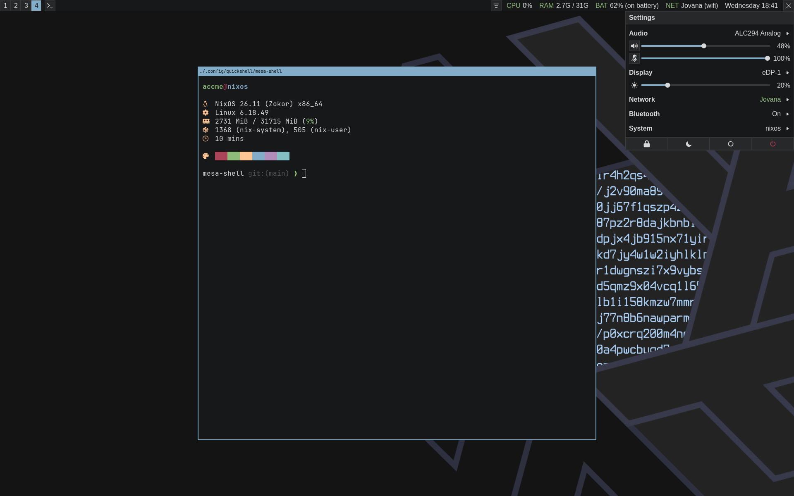

# mesa-shell

A minimal status bar, notification daemon and quick settings panel for
[Quickshell](https://github.com/outfoxxed/quickshell), built for Sway.

The settings panel is a `wlr-layer-shell` surface pinned to the top right
corner, laid out like a quick settings menu: a home view with status tiles and
volume sliders, and a sub-view per section reached through the `>` chevrons. It
opens on the focused Sway output, and closes on `Escape` or a click anywhere
else on the desktop.



## Dependencies

| Dependency | Used for |
| --- | --- |
| [Quickshell](https://github.com/outfoxxed/quickshell) | The runtime the whole shell is built on |
| `qt6.qt5compat` | `Qt5Compat.GraphicalEffects`, used to recolour the SVG icons |
| Sway | Workspaces and binding mode over the Sway IPC socket; the bar and notifications are `wlr-layer-shell` surfaces |
| UPower | Battery widget and the About view's battery details |
| PipeWire | Audio view: sinks, sources, playback and recording streams |
| NetworkManager | Network widget and the Wi-Fi / Ethernet views |
| BlueZ | Bluetooth view: adapters, pairing, connecting |

The shell registers itself as the `org.freedesktop.Notifications` service, so it
will not show notifications while another daemon (mako, dunst, ...) holds that
name.

Any font available to fontconfig works — no Nerd Font glyphs are used; every
icon is an SVG in `assets/`.

## IPC

Quickshell names a config after the directory it sits in, so cloning this repo
as `mesa-shell` registers it under that name rather than as the `default`
config. Every command therefore needs `-c mesa-shell`; without it you get
`Could not find "default" config directory or shell.qml in any valid config path.`

Handlers are reachable through `qs -c mesa-shell ipc call <target> <function>`.
Run `qs -c mesa-shell ipc show` to list them from a running instance.

### `dmenu` — the launcher in the bar

```bash
qs -c mesa-shell ipc call dmenu open
qs -c mesa-shell ipc call dmenu close
qs -c mesa-shell ipc call dmenu toggle
```

### `settingsWindow` — the quick settings panel

```bash
qs -c mesa-shell ipc call settingsWindow open
qs -c mesa-shell ipc call settingsWindow close
qs -c mesa-shell ipc call settingsWindow toggle
```

`view` opens the panel straight onto a sub-view — `audio`, `network`,
`bluetooth` or `about`. Any other name lands on the home view.

```bash
qs -c mesa-shell ipc call settingsWindow view network
```

### `config` — re-read `config.json`

```bash
qs -c mesa-shell ipc call config reload
```

The config file is watched and reloaded on change, so this is only needed when
something writes it in a way the watcher misses.

### Sway keybindings

```
bindsym $mod+d exec qs -c mesa-shell ipc call dmenu toggle
bindsym $mod+p exec qs -c mesa-shell ipc call settingsWindow toggle
bindsym $mod+n exec qs -c mesa-shell ipc call settingsWindow view network
```

## Installation

Clone the repository into your Quickshell config directory. The directory name
becomes the config name:

```bash
git clone git@github.com:accmeboot/mesa-shell.git ~/.config/quickshell/mesa-shell
```

That leaves `~/.config/quickshell/mesa-shell/shell.qml` in place.

Create a config from the example:

```bash
cp ~/.config/quickshell/mesa-shell/config.example.json \
   ~/.config/quickshell/mesa-shell/config.json
```

`config.json` holds the colours, font, `spacing` and `border` values. It is
watched at runtime, so edits apply without restarting.

Run it:

```bash
qs -c mesa-shell
```

To start it with Sway, add this to your Sway config:

```
exec qs -c mesa-shell -d
```

## Configuration

`config.json` lives next to `shell.qml` and is watched at runtime, so saving it
re-applies immediately. Every key is optional — anything you leave out falls
back to the default below.

### `colors`

The palette is eight semantic roles rather than a fixed set of hues, so a value
is chosen by what it signals, not by what colour it is.

| Key | Default | Used for |
| --- | --- | --- |
| `background` | `#1d2021` | Bar, panel and menu backgrounds |
| `surface` | `#3c3836` | Raised fills — buttons, quick settings tiles, hovered and opened rows, the panel's back header |
| `on_surface` | `#504945` | Every border, and text for secondary values (`Unknown`, `Not paired`) or disabled controls |
| `foreground` | `#d5c4a1` | Primary text and icons |
| `highlight` | `#83a598` | Accent — focused workspace, an active quick settings tile, text selection, slider fill |
| `ok` | `#b8bb26` | Healthy state — connected, paired, enabled, normal threshold band |
| `attention` | `#fabd2f` | Transitional or warning state — connecting, pairing, scanning, warning threshold band |
| `critical` | `#fb4934` | Failure or urgent state — disconnected, errors, urgent notifications, critical threshold band |

### `font`

| Key | Type | Default | Used for |
| --- | --- | --- | --- |
| `font.name` | string | `JetBrainsMono Nerd Font` | Any family fontconfig can resolve |
| `font.size` | number | `12` | Point size; icon sizes are derived from it |

### Metrics

| Key | Type | Default | Used for |
| --- | --- | --- | --- |
| `spacing` | number | `10` | The base unit in pixels. Widget padding, row heights and the gaps between items derive from it, so raising it loosens the whole shell at once |
| `border` | number | `1` | Border width in pixels for every bordered element |

## License

Licensed under the Apache License, Version 2.0. See [LICENSE](LICENSE).
