# mesa-shell

Status bar, notification daemon and lockscreen for [Quickshell](https://github.com/outfoxxed/quickshell), built for Sway.

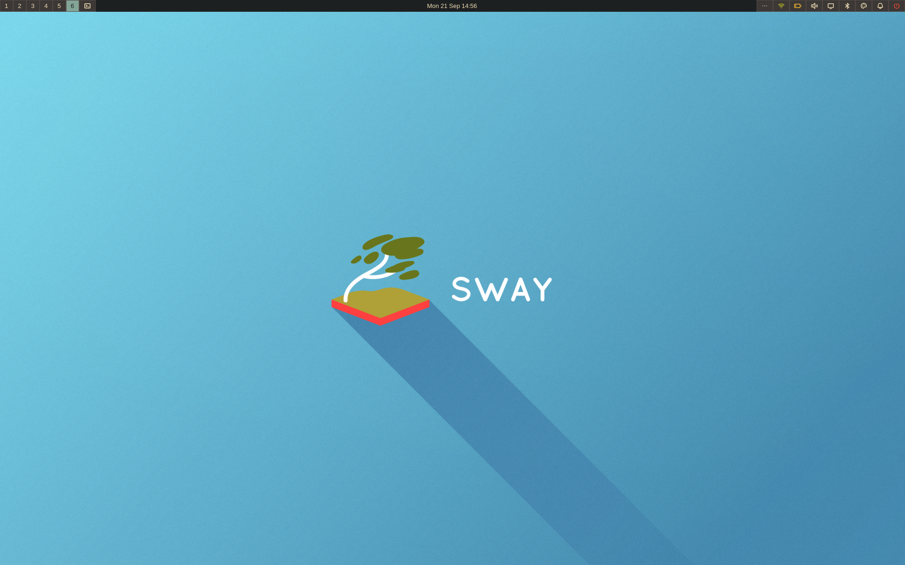

More screenshots in [`assets/screenshots`](assets/screenshots).

## Dependencies

- [quickshell](https://github.com/outfoxxed/quickshell)
  - upower: [`Quickshell.Services.UPower`](https://quickshell.org/docs/v0.3.1/types/Quickshell.Services.UPower/)
  - pipewire: [`Quickshell.Services.Pipewire`](https://quickshell.org/docs/v0.3.1/types/Quickshell.Services.Pipewire/)
  - networkmanager: [`Quickshell.Networking`](https://quickshell.org/docs/v0.3.1/types/Quickshell.Networking/)
  - bluez: [`Quickshell.Bluetooth`](https://quickshell.org/docs/v0.3.1/types/Quickshell.Bluetooth/)
  - pam: [`Quickshell.Services.Pam`](https://quickshell.org/docs/v0.3.1/types/Quickshell.Services.Pam/)
- [sway](https://github.com/swaywm/sway)
- [systemd](https://github.com/systemd/systemd)
- [`brightnessctl`](https://github.com/Hummer12007/brightnessctl) (optional)
- [`socat`](http://www.dest-unreach.org/socat/) (`scripts/mesa-dmenu` only)

## Installation

```bash
git clone git@github.com:accmeboot/mesa-shell.git ~/.config/quickshell/mesa-shell
cp ~/.config/quickshell/mesa-shell/config.example.json ~/.config/quickshell/mesa-shell/config.json
```

Sway config:

```
exec qs -c mesa-shell -d
bindsym $mod+d exec qs -c mesa-shell ipc call dmenu toggle
bindsym $mod+p exec qs -c mesa-shell ipc call panel toggle audio
bindsym $mod+n exec qs -c mesa-shell ipc call panel toggle network
bindsym $mod+c exec qs -c mesa-shell ipc call panel toggle bluetooth
bindsym $mod+m exec qs -c mesa-shell ipc call panel toggle display
bindsym $mod+t exec qs -c mesa-shell ipc call panel toggle tray
bindsym $mod+q exec qs -c mesa-shell ipc call panel toggle power
bindsym $mod+grave exec qs -c mesa-shell ipc call theme toggle
bindsym $mod+backslash exec qs -c mesa-shell ipc call notifications toggle
bindsym $mod+bracketleft exec qs -c mesa-shell ipc call notifications dismissLast
bindsym $mod+bracketright exec qs -c mesa-shell ipc call notifications dismissAll
```

### NixOS

Flake input:

```nix
inputs.mesa-shell = {
  url = "github:accmeboot/mesa-shell";
  inputs.nixpkgs.follows = "nixpkgs";
};
```

Home Manager (`inputs` passed via `extraSpecialArgs`):

```nix
{ inputs, ... }: {
  imports = [ inputs.mesa-shell.homeManagerModules.default ];

  programs.mesa-shell = {
    enable = true;
    settings = { }; # written to config.json, same keys as below
  };

  # replaces `exec qs -c mesa-shell -d`
  programs.quickshell.systemd = {
    enable = true;
    target = "sway-session.target";
  };
}
```

NixOS services used by the modules:

```nix
services.upower.enable = true;
services.pipewire.enable = true;
networking.networkmanager.enable = true;
hardware.bluetooth.enable = true;
```

## Modules

- **Bar**: workspaces, mode, launcher, clock, tray, theme and do-not-disturb toggles
  - audio, network, battery, display, bluetooth and power each open their own panel from the bar
- **Notifications**: `org.freedesktop.Notifications` daemon
- **Lock**: `ext-session-lock-v1` lockscreen
- **Wallpaper**: background layer

### Panels

| Network | Bluetooth |
| --- | --- |
| 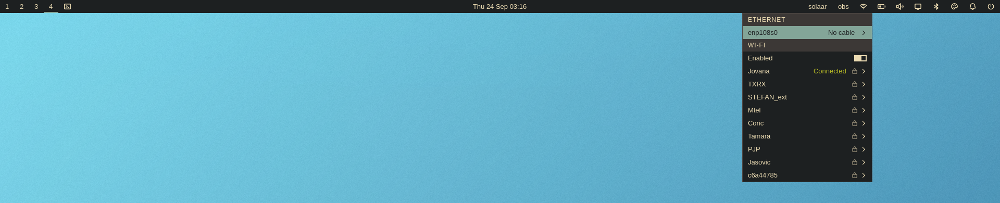 | 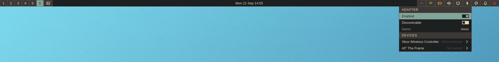 |
| **Audio** | **Display** |
| 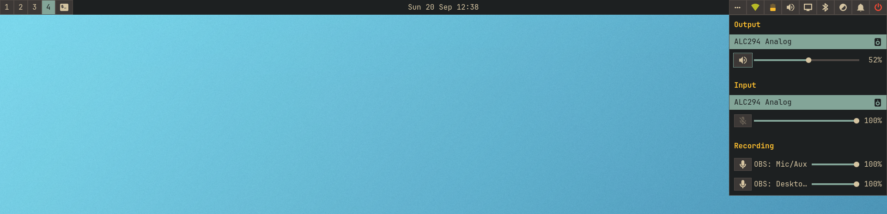 | 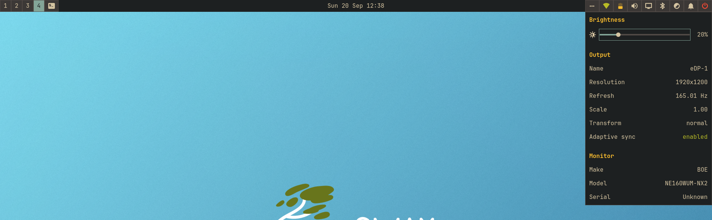 |
| **Battery** | **Power** |
| 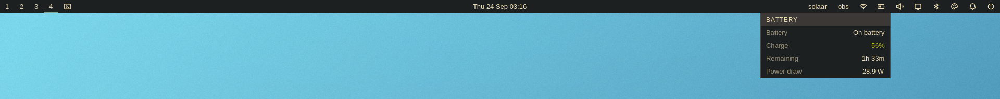 | 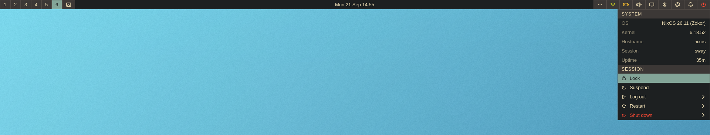 |
| **Launcher** | **Notification** |
| 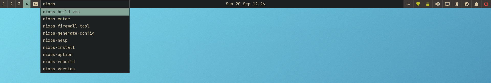 | 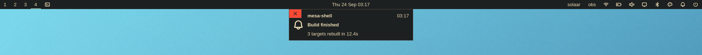 |
| **Tray menu** | **Lock screen** |
| 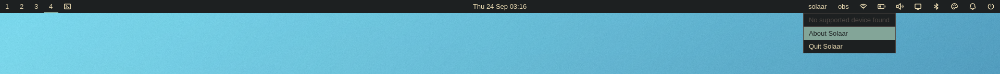 | 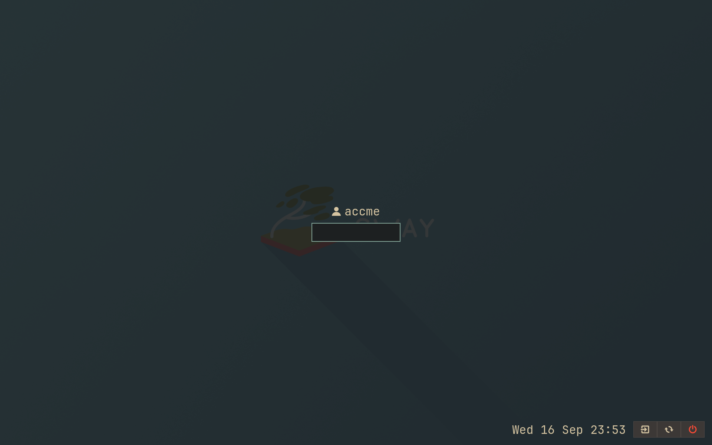 |

## IPC

```bash
qs -c mesa-shell ipc call <target> <function>
```

| Target | Functions |
| --- | --- |
| `panel` | `open <name>`, `close`, `toggle <name>` |
| `dmenu` | `open`, `close`, `toggle` |
| `lock` | `lock`, `isLocked` |
| `theme` | `toggle`, `isDark` |
| `notifications` | `toggle`, `isDoNotDisturb`, `dismissLast`, `dismissAll` |
| `config` | `reload` |

Panel names: `audio`, `network`, `bluetooth`, `display`, `battery`, `power`, `tray`.

```bash
qs -c mesa-shell ipc call panel toggle audio
```

## Keyboard navigation

An open panel takes keyboard focus and selects its first interactive element, drawn as a ring in the highlight colour. Selection follows the mouse too: clicking a control moves the ring to it.

| Key | Action |
| --- | --- |
| `Down`, `j` | next element |
| `Up`, `k` | previous element |
| `Left`, `h` | decrease (sliders) |
| `Right`, `l` | increase (sliders) |
| `Enter`, `Space` | activate |
| `Escape` | close the panel |

### Tray menus

`panel toggle tray` expands the tray if it is collapsed and opens the first menu.

| Key | Action |
| --- | --- |
| `Down`, `j` | next entry |
| `Up`, `k` | previous entry |
| `l` | open submenu |
| `h` | back to the parent menu |
| `Shift+l`, `Shift+h` | next, previous tray menu |
| `Enter`, `Space` | activate entry |
| `Escape` | close the menu |

### Launcher

| Key | Action |
| --- | --- |
| `Down`, `Right`, `Tab`, `Ctrl+j`, `Ctrl+l` | next item |
| `Up`, `Left`, `Shift+Tab`, `Ctrl+k`, `Ctrl+h` | previous item |
| `Enter` | run the selection, or the typed command |
| `Escape` | close |

## Config

`config.json` next to `shell.qml`, see `config.example.json`. Every key is optional.

| Key | Default | Notes |
| --- | --- | --- |
| `colors.{dark,light}.background` | `#1d2021` / `#fbf1c7` | |
| `colors.{dark,light}.surface` | `#3c3836` / `#ebdbb2` | |
| `colors.{dark,light}.on_surface` | `#504945` / `#d5c4a1` | |
| `colors.{dark,light}.foreground` | `#d5c4a1` / `#3c3836` | |
| `colors.{dark,light}.highlight` | `#83a598` / `#076678` | |
| `colors.{dark,light}.ok` | `#b8bb26` / `#79740e` | |
| `colors.{dark,light}.attention` | `#fabd2f` / `#b57614` | |
| `colors.{dark,light}.critical` | `#fb4934` / `#9d0006` | |
| `font.name` | `JetBrainsMono Nerd Font` | |
| `font.size` | `12` | |
| `wallpaper` | `assets/sway.png` | `""` for none |
| `dateTimeFormat` | `ddd d MMM HH:mm` | `Qt.formatDateTime` |
| `defaultPolarity` | `dark` | `dark` or `light` |
| `hooks.onDarkThemeSet` | `""` | shell command |
| `hooks.onLightThemeSet` | `""` | shell command |
| `spacing` | `10` | px |
| `border` | `1` | px |

## dmenu script

`scripts/mesa-dmenu` shows stdin lines in the bar launcher and prints the chosen one. Prints nothing on cancel.

```bash
printf 'a\nb\n' | scripts/mesa-dmenu
```

As the xdg-desktop-portal-wlr screen chooser:

```ini
[screencast]
chooser_type=dmenu
chooser_cmd=/path/to/mesa-dmenu
```

On NixOS:

```nix
xdg.portal.wlr.settings.screencast = {
  chooser_type = "dmenu";
  chooser_cmd = lib.getExe inputs.mesa-shell.packages.${pkgs.stdenv.hostPlatform.system}.mesa-dmenu;
};
```

## License

[Apache 2.0](LICENSE)
