# mesa-shell

Status bar, notification daemon and lockscreen for [Quickshell](https://github.com/outfoxxed/quickshell), built for [dwl](https://codeberg.org/dwl/dwl).

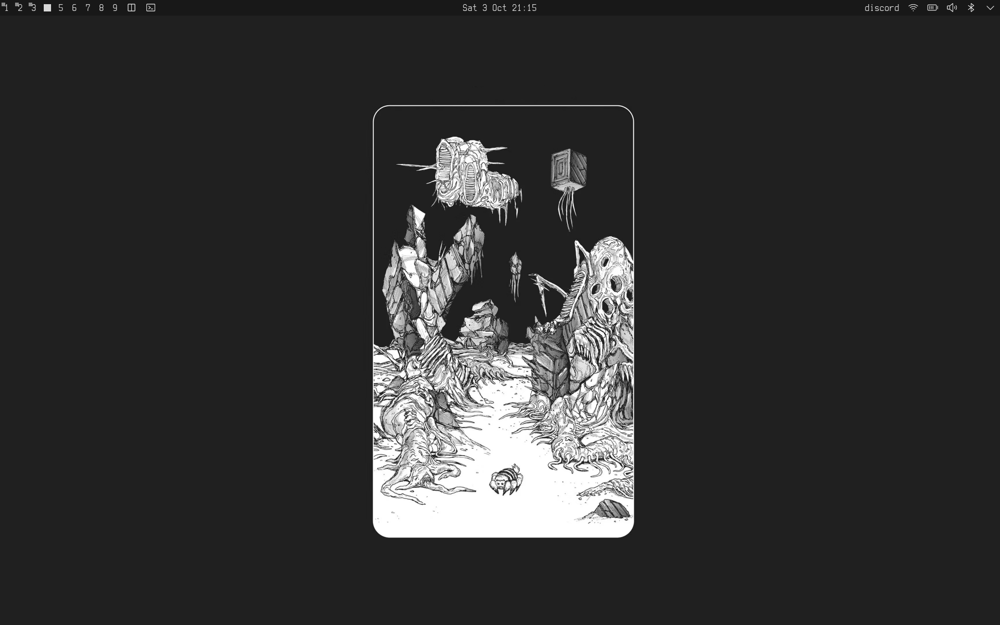

More screenshots in [`assets/screenshots`](assets/screenshots).

## Dependencies

- [quickshell](https://github.com/outfoxxed/quickshell)
  - upower: [`Quickshell.Services.UPower`](https://quickshell.org/docs/v0.3.1/types/Quickshell.Services.UPower/)
  - pipewire: [`Quickshell.Services.Pipewire`](https://quickshell.org/docs/v0.3.1/types/Quickshell.Services.Pipewire/)
  - networkmanager: [`Quickshell.Networking`](https://quickshell.org/docs/v0.3.1/types/Quickshell.Networking/)
  - bluez: [`Quickshell.Bluetooth`](https://quickshell.org/docs/v0.3.1/types/Quickshell.Bluetooth/)
  - pam: [`Quickshell.Services.Pam`](https://quickshell.org/docs/v0.3.1/types/Quickshell.Services.Pam/)
- [`bluetoothctl`](https://github.com/bluez/bluez) from bluez (pairing agent)
- [dwl](https://codeberg.org/dwl/dwl) with the [`ipc`](https://codeberg.org/dwl/dwl-patches/src/branch/main/patches/ipc) patch
  - [`dwlmsg`](https://codeberg.org/notchoc/dwlmsg) (needs a patch for the ipc patch's `focused_geometry` event, see below)
- [systemd](https://github.com/systemd/systemd)
- [`gsettings`](https://gitlab.gnome.org/GNOME/glib) from glib2 with gsettings-desktop-schemas (dark theme follows and toggles `org.gnome.desktop.interface color-scheme`)
- [`brightnessctl`](https://github.com/Hummer12007/brightnessctl) (optional)
- [`fuser`](https://gitlab.com/psmisc/psmisc) from psmisc (optional, camera detection for apps opening `/dev/video*` directly)
- [`socat`](http://www.dest-unreach.org/socat/) (`scripts/mesa-dmenu` only)

## Installation

```bash
git clone git@github.com:accmeboot/mesa-shell.git ~/.config/quickshell/mesa-shell
cp ~/.config/quickshell/mesa-shell/config.example.json ~/.config/quickshell/mesa-shell/config.json
```

Start it from dwl's startup command, with `XDG_CURRENT_DESKTOP=dwl` set so the shell picks the dwl backend:

```bash
dwl -s 'qs -c mesa-shell -d'
```

`config.h` keys:

```c
{ MODKEY, XKB_KEY_d,          spawn, SHCMD("qs -c mesa-shell ipc call dmenu toggle") },
{ MODKEY, XKB_KEY_p,          spawn, SHCMD("qs -c mesa-shell ipc call panel toggle audio") },
{ MODKEY, XKB_KEY_n,          spawn, SHCMD("qs -c mesa-shell ipc call panel toggle network") },
{ MODKEY, XKB_KEY_c,          spawn, SHCMD("qs -c mesa-shell ipc call panel toggle bluetooth") },
{ MODKEY, XKB_KEY_t,          spawn, SHCMD("qs -c mesa-shell ipc call panel toggle tray") },
{ MODKEY, XKB_KEY_q,          spawn, SHCMD("qs -c mesa-shell ipc call panel toggle control") },
{ MODKEY, XKB_KEY_grave,      spawn, SHCMD("qs -c mesa-shell ipc call theme toggle") },
{ MODKEY, XKB_KEY_backslash,  spawn, SHCMD("qs -c mesa-shell ipc call notifications toggle") },
{ MODKEY, XKB_KEY_bracketleft,  spawn, SHCMD("qs -c mesa-shell ipc call notifications dismissLast") },
{ MODKEY, XKB_KEY_bracketright, spawn, SHCMD("qs -c mesa-shell ipc call notifications dismissAll") },
```

### NixOS

Flake input:

```nix
inputs.mesa-shell = {
  url = "github:accmeboot/mesa-shell";
  inputs.nixpkgs.follows = "nixpkgs";
};
```

The flake only provides the config files and `mesa-dmenu`; link them yourself (`inputs` passed via `extraSpecialArgs`):

```nix
{ inputs, pkgs, ... }: {
  programs.quickshell = {
    enable = true;
    activeConfig = "mesa-shell";
  };

  xdg.configFile."quickshell/mesa-shell" = {
    source = "${inputs.mesa-shell.packages.${pkgs.stdenv.hostPlatform.system}.default}/share/mesa-shell";
    recursive = true;
  };
}
```

`dwlmsg` from upstream aborts on dwl's ipc patch: the patch adds a `focused_geometry` event that dwlmsg's bundled protocol doesn't know, and libwayland aborts on events without a listener. Update dwlmsg's `protocols/dwl-ipc-unstable-v2.xml` to the one from the ipc patch and add an empty `focused_geometry` listener. The layout widget also expects `dwlmsg -w` to print a `layout_index <n>` line from the `layout` event.

NixOS services used by the modules:

```nix
services.upower.enable = true;
services.pipewire.enable = true;
networking.networkmanager.enable = true;
hardware.bluetooth.enable = true;
```

## Modules

- **Bar**: tags, layout, launcher, clock and tray
  - left click a tag to view it, right click to toggle it into the view
  - layout, audio, network, battery, bluetooth and control each open their own panel from the bar
  - the control panel holds the brightness slider, the dark theme and do-not-disturb toggles and the session actions (lock, suspend, log out, restart, shut down)
  - the dark theme toggle switches the desktop's `color-scheme` setting, and the shell follows that setting whoever changes it
  - privacy indicators for microphone, camera and screen share, with a panel listing the apps using them
- **Notifications**: `org.freedesktop.Notifications` daemon
- **Lock**: `ext-session-lock-v1` lockscreen
- **Wallpaper**: background layer

### Panels

| Network | Bluetooth |
| --- | --- |
| 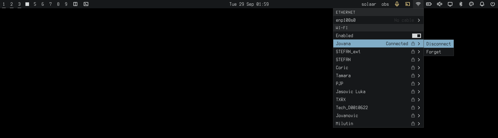 | 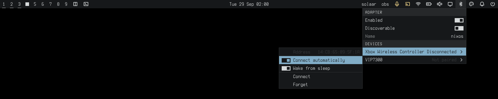 |
| **Audio** | **Control** |
| 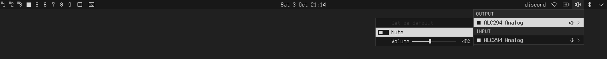 | 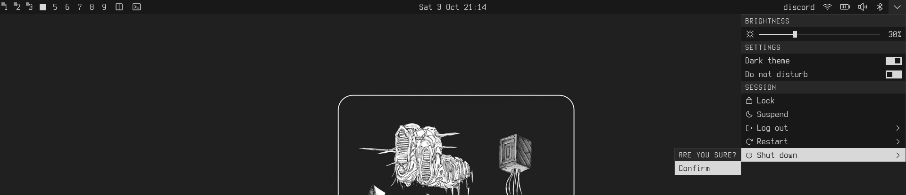 |
| **Battery** | |
| 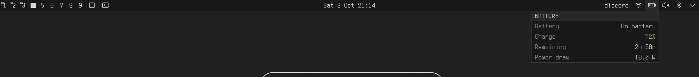 | |
| **Layout** | **Privacy** |
| 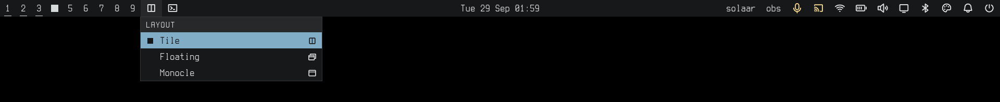 | 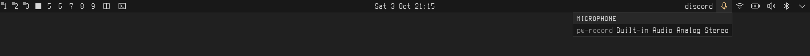 |
| **Launcher** | **Notification** |
| 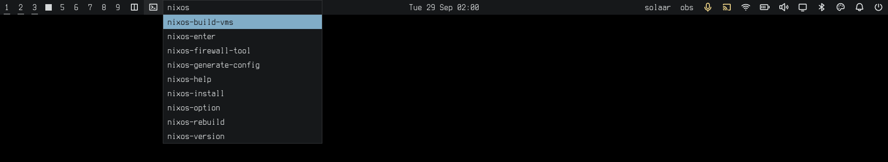 | 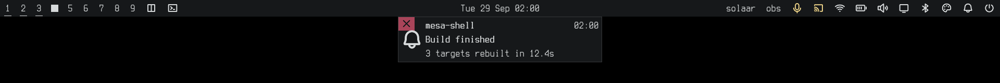 |
| **Tray menu** | **Lock screen** |
| 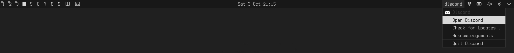 | 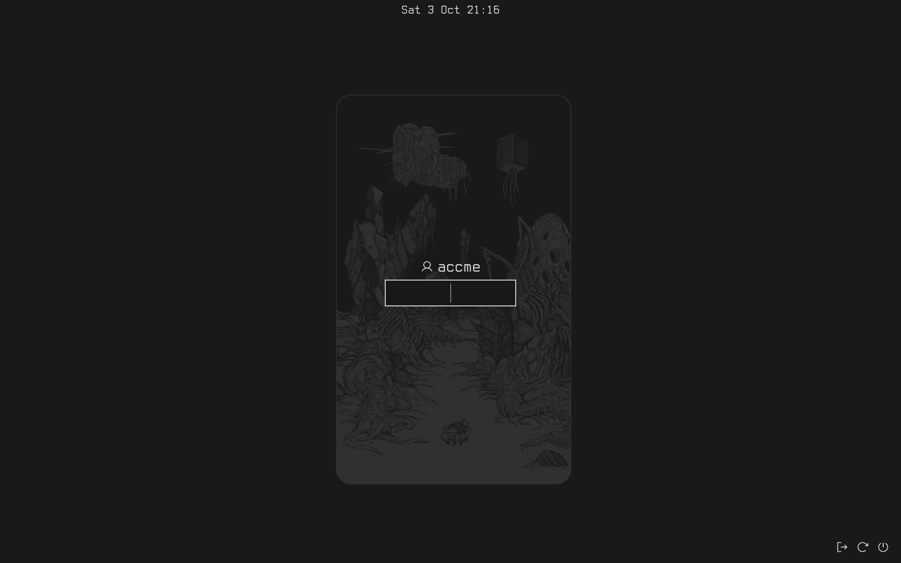 |

## IPC

```bash
qs -c mesa-shell ipc call <target> <function>
```

| Target | Functions |
| --- | --- |
| `panel` | `open <name>`, `close`, `toggle <name>` |
| `dmenu` | `open`, `close`, `toggle` |
| `lock` | `lock`, `isLocked` |
| `theme` | `toggle`, `isDark` |
| `notifications` | `toggle`, `isDoNotDisturb`, `dismissLast`, `dismissAll` |
| `config` | `reload` |

Panel names: `layout`, `audio`, `network`, `bluetooth`, `battery`, `control`, `tray`, `privacy`. `privacy` only opens while a microphone, camera or screen share is in use.

```bash
qs -c mesa-shell ipc call panel toggle audio
```

## Keyboard navigation

An open panel takes keyboard focus and selects its first interactive element, drawn as a fill in the highlight colour. Selection follows the mouse too: hovering an interactive row selects it, and opens that row's menu if it has one.

Panels are built from rows. A row either acts on its own or opens a menu, and `Down`/`Up` move between rows until a menu is open, at which point they move within it.

| Key | Action |
| --- | --- |
| `Down`, `j` | next row, or next entry while a menu is open |
| `Up`, `k` | previous row, or previous entry while a menu is open |
| `Right`, `l` | open the selected row's menu |
| `Left`, `h` | close the open menu |
| `Shift+Right`, `Shift+l` | increase the open menu's slider |
| `Shift+Left`, `Shift+h` | decrease the open menu's slider |
| `Enter`, `Space` | activate the selection |
| `Escape` | close the panel |

Sliders live inside menus, except for brightness, which sits directly in the control panel. That one takes the selection itself, and `Left`/`h` and `Right`/`l` then decrease and increase it. Either kind moves in 1% steps.

### Menu text entry

A menu entry can be a text field, such as the Wi-Fi password prompt. While one is selected, printable keys type into it, so `h`, `j`, `k` and `l` insert characters rather than navigating. The arrow keys still navigate.

| Key | Action |
| --- | --- |
| `Backspace` | delete the last character |
| `Ctrl+Backspace`, `Ctrl+u` | clear the field |
| `Enter` | submit, once the field is not empty |

### Tray menus

`panel toggle tray` opens the first tray menu.

| Key | Action |
| --- | --- |
| `Down`, `j` | next entry |
| `Up`, `k` | previous entry |
| `l` | open submenu |
| `h` | back to the parent menu |
| `Shift+l`, `Shift+Right` | next tray menu |
| `Shift+h`, `Shift+Left` | previous tray menu |
| `Enter`, `Space` | activate entry |
| `Escape` | close the menu |

### Launcher

| Key | Action |
| --- | --- |
| `Down`, `Right`, `Tab`, `Ctrl+j`, `Ctrl+l` | next item |
| `Up`, `Left`, `Shift+Tab`, `Ctrl+k`, `Ctrl+h` | previous item |
| `Enter` | run the selection, or the typed command |
| `Escape` | close |

## Config

`config.json` next to `shell.qml`, see `config.example.json`. Every key is optional.

`include` lists more JSON files with the same keys, laid over `config.json` in order (later files win). Paths are absolute, `~/` or relative to `config.json`; missing files are skipped. Useful for colors generated by a theming tool, e.g. one file per polarity that only sets `colors.dark` or `colors.light`.

| Key | Default | Notes |
| --- | --- | --- |
| `colors.{dark,light}.background` | `#16181a` / `#faf8f3` | |
| `colors.{dark,light}.surface` | `#26282a` / `#eae8e3` | |
| `colors.{dark,light}.on_surface` | `#36383a` / `#dad8d3` | |
| `colors.{dark,light}.foreground` | `#d6d9da` / `#393834` | |
| `colors.{dark,light}.highlight` | `#81adc7` / `#78b1ba` | |
| `colors.{dark,light}.ok` | `#8eba7a` / `#b3af62` | |
| `colors.{dark,light}.attention` | `#ead086` / `#ead086` | |
| `colors.{dark,light}.critical` | `#a94459` / `#a94b27` | |
| `font.name` | `""` | `""` uses the fontconfig default |
| `font.size` | `""` | pt, `""` uses the fontconfig default |
| `wallpaper.{dark,light}` | `assets/hello-world.png` | `""` for none |
| `dateTimeFormat` | `ddd d MMM HH:mm` | `Qt.formatDateTime` |
| `include` | `[]` | JSON files laid over this one |
| `spacing` | `10` | px |
| `border` | `1` | px |

## dmenu script

`scripts/mesa-dmenu` shows stdin lines in the bar launcher and prints the chosen one. Prints nothing on cancel.

```bash
printf 'a\nb\n' | scripts/mesa-dmenu
```

As the xdg-desktop-portal-wlr screen chooser:

```ini
[screencast]
chooser_type=dmenu
chooser_cmd=/path/to/mesa-dmenu
```

On NixOS:

```nix
xdg.portal.wlr.settings.screencast = {
  chooser_type = "dmenu";
  chooser_cmd = lib.getExe inputs.mesa-shell.packages.${pkgs.stdenv.hostPlatform.system}.mesa-dmenu;
};
```

## License

[Apache 2.0](LICENSE)
